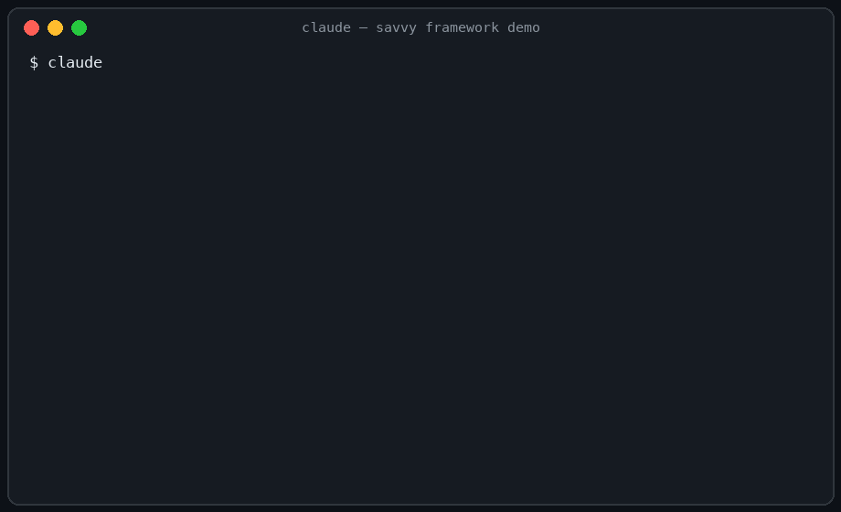

# Savvy Framework (`sf`)

[](https://github.com/shaunchew/savvy-template/actions/workflows/ci.yml)
[](LICENSE)

A self-policing AI-dev framework for solo developers, shipped as a **Claude Code plugin**. Spec-driven workflow, deterministic session hooks, scratchpad mode, and a safety contract most scaffolding tools don't make:

> **Adopting, upgrading, or removing the framework never deletes or overwrites your files.**
> Everything is create-if-absent, additively merged, or quarantined — and every claim is enforced by tests in CI.



## Install (any project — new or existing)

```
/plugin marketplace add shaunchew/savvy-template
/plugin install sf@savvy
```

Then, inside the project you want to adopt:

```
/sf:adopt --dry-run     # see the exact plan — changes nothing
/sf:adopt               # do it (refuses a dirty git tree)
```

`/sf:adopt` seeds context files (`AGENTS.md`, `constitution.md`, `ROADMAP.md`, …) **only where they don't exist**, additively merges safety rules into `.claude/settings.json` (yours are preserved, the original is backed up), and enables the plugin for this project only. If the project used an older in-tree version of the framework, its engine files are **moved to a quarantine dir, never deleted** — local edits survive.

Not sure about the state of an installation? `/sf:doctor` (read-only). Want out? `/sf:eject` reverses adoption with the same guarantees and keeps every file you edited.

## What you get

| Area | Commands |
|---|---|
| Spec-driven flow | `/sf:spec` → `/sf:clarify` → `/sf:plan` → `/sf:analyze` → `/sf:implement` → `/sf:ship` |
| Project context | `/sf:intake`, `/sf:map` (brownfield as-built baseline), `/sf:curate`, `/sf:handover`, `/sf:resume-handover`, `/sf:lesson` |
| Safety & lifecycle | `/sf:adopt`, `/sf:doctor`, `/sf:eject`, `/sf:upgrade` (legacy), `/sf:lint-framework` |
| Exploration | `/sf:scratchpad` (isolated experiments), `/sf:legacy-review` (brownfield triage) |

Polyglot by design: `scripts/sf-stack.sh` detects your stack (Node/Python/Rust/Go/Ruby/JVM/PHP/Elixir/.NET and more) deterministically from manifests — read-only, zero dependencies — and the format hook speaks prettier, black, gofmt, rustfmt, shfmt, and terraform fmt, each only when the tool already exists in your project.

Plus deterministic hooks (session context loading, secret-scan blocking on every Bash call, doc line-budgets) and three canonical subagents (explorer, code-reviewer, parallel-runner). Hooks **only act in adopted projects** — installing the plugin changes nothing in your other repos, with one deliberate exception: the secret-scan guard blocks credential-leaking Bash commands everywhere (it blocks secrets, and nothing else — it never touches files).

## The safety contract, concretely

| Operation | Guarantee | Enforced by |
|---|---|---|
| `/sf:adopt` | create-if-absent; additive merge; dirty-tree guard; `--dry-run`; symlink + invalid-JSON pre-flight | `tests/test-adopt-*.sh` |
| detach (legacy engine) | quarantined to `.claude/.savvy-detached-<ts>/`, never deleted; user hooks/files preserved | `tests/test-adopt-detach.sh` |
| `/sf:eject` | edited files kept; unedited seeds quarantined; plugin disabled | `tests/test-doctor-eject-dryrun.sh` |
| engine updates | out-of-tree plugin cache; version-gated `/plugin update` — cannot touch project files | plugin architecture |
| hooks | no-op outside adopted projects (except secret-scan, which blocks credential leaks everywhere and touches nothing) | `tests/test-hooks-*.sh` |

Run the suite yourself from a git checkout: `bash tests/run.sh` (needs only bash 3.2+, git, jq).

## For existing projects with heavy history

`/sf:intake` builds context from your codebase in approval-gated batches; `/sf:legacy-review` triages non-conforming files into `_legacy/` with per-item confirmation and a written restore path. Nothing moves without `git mv` on a clean tree.

## Development

See [CONTRIBUTING.md](CONTRIBUTING.md). TL;DR: repo root is the plugin payload (the only authored source); `template/` and `skeleton/` are generated by `scripts/build-plugin.sh`; every change to `scripts/`, `hooks/`, or `migrations/` needs a test; CI runs everything on Linux and macOS system bash.

## Legacy paths

Projects scaffolded by the pre-plugin Copier template keep working: `/sf:upgrade` (manifest-driven, conflict-safe) upgrades them in place, and `/sf:adopt` moves them onto the plugin engine whenever ready. The Copier/curl scaffolding path is deprecated and will be removed in v2.0.

## License

MIT
